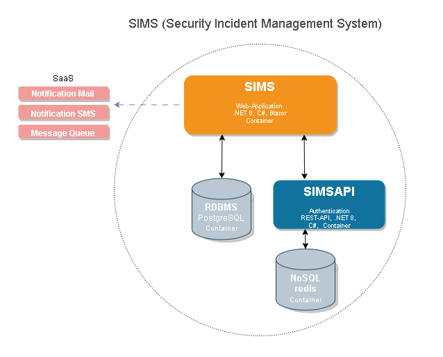

# SIMS "Security Incident Management System"

## Quickstart
``` init.cmd ```

## Usernames
- admin/admin
- user/user

## Environment-Variables

### Postgres
- POSTGRES_PASSWORD
- POSTGRES_USER
- POSTGRES_DB

### SIMSAPI
- redisdb: Hostname of redis database
- postgresdb: Connectionstring of PostgresDB (e.g. Host=simsdb1;Username=postgresadmin;Password=1234;Database=db1)

### SIMS
- postgresdb: Connectionstring of PostgresDB (e.g. Host=simsdb1;Username=postgresadmin;Password=1234;Database=db1)

## Docker builds
```
docker build -t simsdb databasePostgres\.
docker build -t simsapi --label "latest" SIMSAPI\.
docker build -t sims --label "latest" SIMS\.
```

## Docker run examples
```
docker run --name simsdb1 -p5432:5432 -e POSTGRES_PASSWORD=1234 -e POSTGRES_USER=postgresadmin -e POSTGRES_DB=db1 -d simsdb
docker run --name redisdb1 -p6379:6379 -d redis
docker run --name simsapi1 -p8888:8080 -e redisdb=redisdb1 --link redisdb1 -d simsapi:latest
docker run --name sims1 -p8080:8080 -e api=http://simsapi1:8080 -e postgresdb="Host=simsdb1;Username=postgresadmin;Password=1234;Database=db1" --link simsdb1 --link simsapi1 -d sims:latest
```

## Architecture

